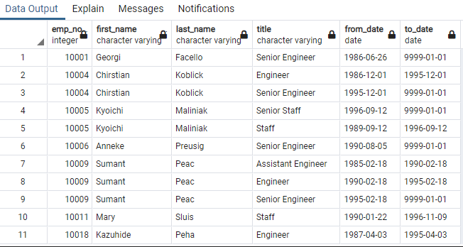
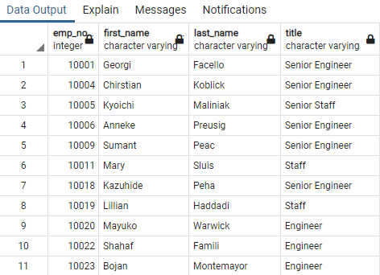
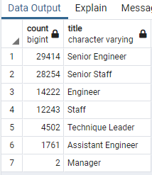
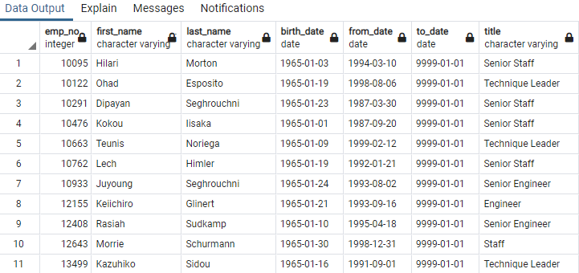

# Pewlett-Hackard-Analysis

Now that Bobby has proven his SQL chops, his manager has given both of you two more assignments: determine the number of retiring employees per title, and identify employees who are eligible to participate in a mentorship program. Then, you’ll write a report that summarizes your analysis and helps prepare Bobby’s manager for the “silver tsunami” as many current employees reach retirement age.

## Overview
The purpose of this project is to perform analysis on a large-scale of employee data for a company with over 300,000 employees.

## Results

1. With the retirment_titles table we are able to see every eligible for retirement employee and how long they have worked at each position over the course of their career. here are duplicate entries for some employees because they have switched titles over the years.

2. The unique_titles table that we created is showing the most recent title for employees of retirment age.

3. We can use the retiring_titles table to retrieve the number of employees by their most recent job title who are about to retire. The best two positions are Seenior Engineer and Senior Staff.

4. Our Mentorship Eligibility table holds the employees who are eligible to participate in a mentorship program.

## Summary

- How many roles will need to be filled as the "silver tsunami" begins to make an impact?

90,398 roles are in urgent need to be filled out as soon as the workforce starts retiring at any given time.

- Are there enough qualified, retirement-ready employees in the departments to mentor the next generation of Pewlett Hackard employees?

No, we have 1,549 employees who are eligible to participate in a mentorship program.

- Provide two additional queries or tables that may provide more insight into the upcoming "silver tsunami."

mentorship_eligibilty group by birth_date (or by year of birth_date), and mentorship_eligibilty group by title to see the distribution of data.
